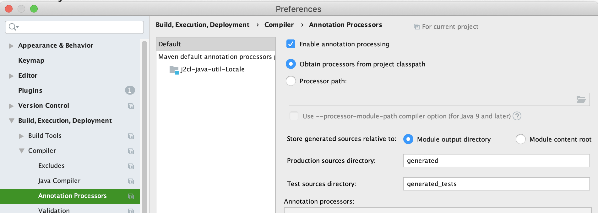

[](https://travis-ci.com/mP1/j2cl-java-util-TimeZone.svg?branch=master)
[](https://coveralls.io/github/mP1/j2cl-java-util-TimeZone?branch=master)
[](https://opensource.org/licenses/Apache-2.0)
[](https://lgtm.com/projects/g/mP1/j2cl-java-util-TimeZone/context:java)
[](https://lgtm.com/projects/g/mP1/j2cl-java-util-TimeZone/alerts/)


# java.util.TimeZone

This project aims to provide a mostly complete pure Java `java.util.TimeZone`. 

- Only selected ids/TimeZones will appear in methods like `java.util.TimeZone#getAvailableIDs` and `java.util.TimeZone#getTimeZone`. 
- Localization data for `java.util.TimeZone#getDisplay` is only provided for selected locales, timezone ids at build time by an [annotation processor](https://github.com/mP1/j2cl-java-util-TimeZone-annotation-processor).
- Serialization is not supported, and all support classes and forms including magic methods such as `writeReplace` are removed.


## defines

A default `java.util.TimeZone` is required and must appear within the j2cl-maven-plugin [defines](https://github.com/mP1/j2cl-maven-plugin#defines) section. 

```xml
<walkingkooka.j2cl.java.util.timezone.TimeZone.DEFAULT>Australia/Sydney</walkingkooka.j2cl.java.util.timezone.TimeZoneDEFAULT>
```


## Annotation processor arguments

- See [j2cl-java-util-locale-annotation-processor](https://github.com/mP1/j2cl-java-util-locale-annotation-processor) for more info about selecting which locales get bundled.
- See [j2cl-java-util-TimeZone-annotation-processor](https://github.com/mP1/j2cl-java-util-TimeZone-annotation-processor) for more info about selecting which timezones get bundled.
- See [j2cl-locale](https://github.com/mP1/j2cl-locale) for more info about logging.


## Unsupported APIs

`java.util.TimeZone`

- setId throws UnsupportedOperationException, timezones are immutable

`java.util.SimpleTimeZone`
- Class missing

## Transpiling

The `j2cl-maven-plugin` will shade the source during the transpile phase, so `TimeZone`
is available to the runtime as `java.util.TimeZone` and something similar for `SimpleTimeZone`. 


## Getting the source

You can either download the source using the "ZIP" button at the top
of the github page, or you can make a clone using git:

```
git clone git://github.com/mP1/j2cl-java-util-TimeZone.git
```


### IDE build setup

Annotation processors from class path must be enabled as some tests test the output of generated classes.

The star/wildcard may need to be escaped with a backslash.

